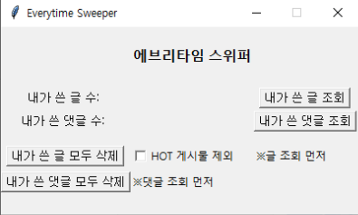

# Everytime Sweeper
크롤링을 이용한 에브리타임 글 및 댓글 자동삭제 프로그램입니다.

## 준비물
- 크롬 브라우저
- Python 3
- Selenium (pip install selenium)
- BeautifulSoup (pip install bs4)

## 사용법
- 폴더 내에 **gui.py**를 실행 시켜 주세요.
- 프로그램을 실행하면 브라우저와 검은 창(chromedriver)이 함께 열립니다. 두 창은 프로그램 동작 중에 닫지 말아주세요.
- 로그인에 성공하면 여러 제어 버튼을 눌러 내 에브리타임 계정을 청소할 수 있습니다.
- 해당 프로그램은 에브리타임 웹사이트를 제외한 어떠한 정보도 외부로 전송하지 않습니다.

### 내가 쓴 글 조회
로그인된 에브리타임 몇 개의 글이 써져있는지 조회합니다.

### 내가 쓴 댓글 조회
로그인된 에브리타임 몇 개의 댓글이 써져있는지 조회합니다.

### 내가 쓴 글 모두 삭제
내가 쓴 글을 모두 삭제합니다. **단, 글 조회를 먼저 해야합니다.** HOT 게시물 제외를 클릭한 후 삭제 버튼을 누르면 HOT 게시물에 간 글(공감 10개 이상)은 제외하고 모두 삭제합니다.

### 내가 쓴 댓글 모두 삭제
내가 쓴 댓글을 모두 삭제합니다. **단, 댓글 조회를 먼저 해아합니다.**

## 사용시 주의사항
- 사용자의 컴퓨터에 크롬 브라우저가 설치되어 있어야 합니다.
- 폴더내에 chromedriver.exe의 버전과 크롬 브라우저의 버전이 일치해야 정상적으로 작동합니다.
- 배포한 폴더내에 포함된 chromedriver의 버전은 84입니다. 다른 버전의 크롬 브라우저를 사용하는 경우 폴더내에 알맞은 chromedriver를 다운로드 받아 넣어주세요.
- 프로그램이 조회 및 삭제 동작 중엔 크롬 브라우저를 건드리거나 프로그램 버튼을 누르면 안됩니다.
- 인터넷 환경이 좋지 않거나 글이나 댓글이 많은 경우 작동이 제대로 되지 않거나 오래 걸릴 수 있습니다.
